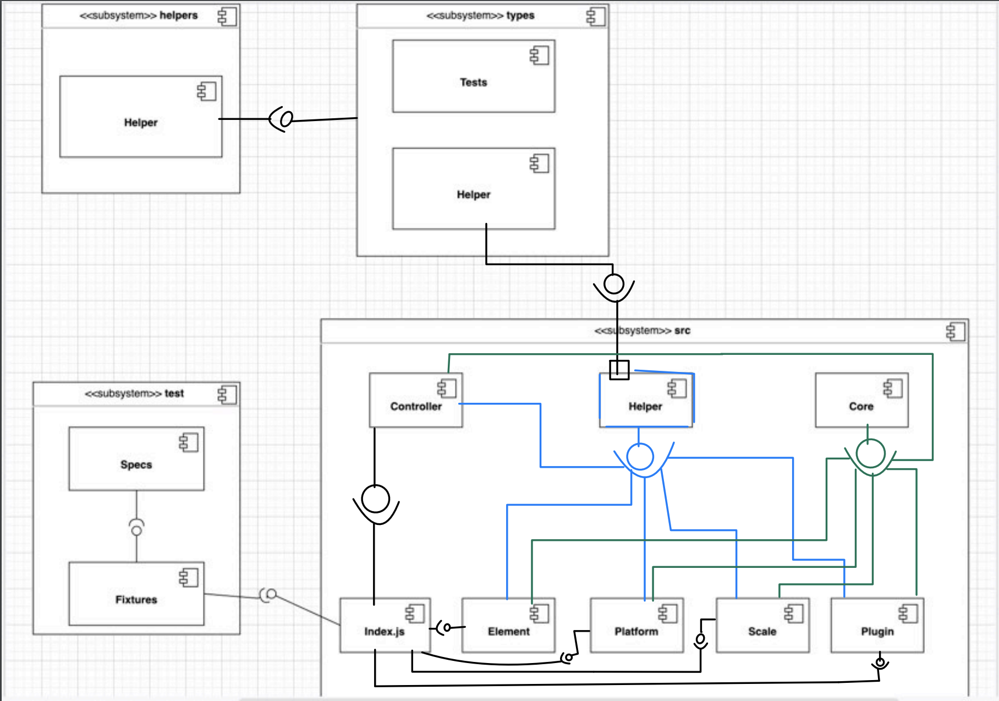
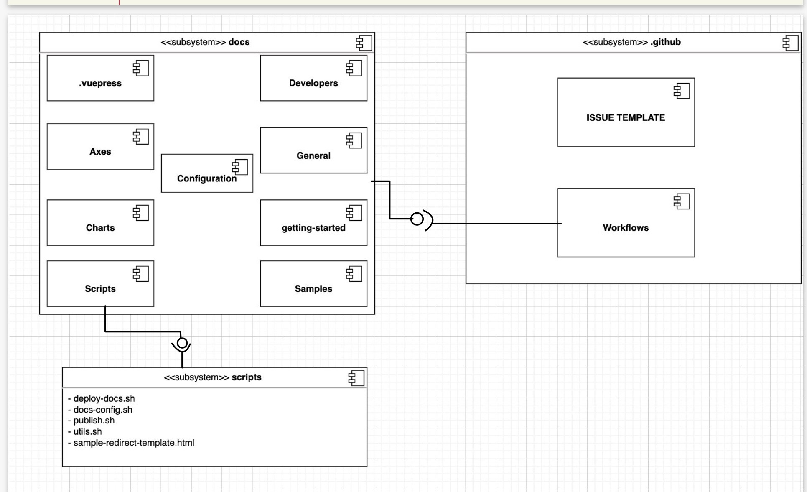
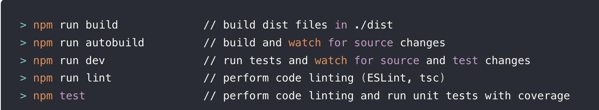
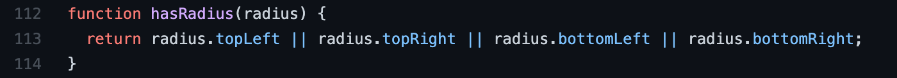

# INFO 443 Project 2 (chart.js)

## Context and Background

**What is the software system, and what does it do?**

`Chart.js` is an open-source JavaScript library for creating data visualizations. It can visualize your data in eight different ways, each of them animated, customizable, and responsive. It is great at rendering performance across modern browsers.

**Who created the software, and who currently "maintains" it? Was it developed by a large company or an independent developer? Who seems to be in charge of approving changes to its code/architecture?)**

`Chart.js` was originally created by developer Nick Downie in 2013. It is now open for contribution by the entire developer community, but a dedicated `Chart.js` team of seven people is in charge of approving changes.

**Where can we find more information about the system?**

Official repo:
https://github.com/chartjs/Chart.js  
Documentation: https://www.chartjs.org/docs/latest/

## Development View

_What modules (components) comprise the system, how are they organized, and how do they interact?_

**Component Diagram**

| |
|:--:|
| _Figure 1: UML Component Diagram Part 1_|

||
|:--:|
| _Figure 2: UML Component Diagram Part 2_|
> These two figures represent the component diagram of this system's structure and organization.

This text refers to the UML Component Diagram Part 1 and UML Component Diagram Part 2 and explains each architectural component of the system.

The _types_ folder contains tests and `helper` components that use typeScript to create object types, which is given to the `helpers.core.js` of the _src_ folder, a required interface.
The `helper` components of the _src_ folder has helper functions that aid other modules to perform their work. The `core` components contain the foundation functions to create charts. Both `core` and `helper` components deal with handling the data and both are the provided interfaces for the rest of the components in the `src` folder. The `controller` components control or manage the data for each different type of chart.  The `element` components do the work of computing the mathematical attributes for charts with arc, line, point and bar attributes. The `platform` components sets up the platform for the chart. The `scale` components compute the chart scales for time series, logarithmic, linear, category and more. The `plugin` components deal with the chart attributes, like title, subtitle, Tooltip, legend, and more. All of these components are provided interfaces for the `index.js`, which brings everything all together and exports the chart made. The _test_ folder and its components are a required interfaces for the `index.js` from the _src_ folder. In the _test_ folder, the `fixtures` set up the environment for testing and `specs` are the actual automated tests. There is the `docs` folder that contains all documentation Markdown files, which are then published with Vuepress.

**Source Code Structure**

This textual description discusses the high-level codeline model, which focuses on where and how the components are organized in which files.

This system mostly has a source code structure that mirrors the component structure. This means architectural elements (components) have a one-to-one relationship with code modules (files).

**Testing and Configuration**

This system has automated testing integrated into the code for developers and contributors to use.  They use it to test their code and check that is passes `eslint` code standards. After using `npm install` to install node and npm, running `npm test` will run both the linter and tests.

||
|:--:|
| _Figure 3: `npm` commands to perform tests_|
> These are the following commands that are now available from the repository root. `npm run dev `and `npm test` can be appended with a string that is used to match the spec filenames.

This system also has image-based testing to make sure that a chart is matching the expected image pixel-by-pixel. The instructions to create a new image-based test can be found under the "Image-Based Tests" section here: https://www.chartjs.org/docs/latest/developers/contributing.html

For **bugs and issues**, they are reported on the issues tab at https://github.com/chartjs/Chart.js and used to improve and create further tests to check the functionality of the library.

If a user wants to report a bug, they should:
- check if it's already an existing issue
- isolate the problem to a simple test case
- include a demonstration of the bug on a website such as https://jsbin.com/ or https://codepen.io/pen/

All this information is from the `chart.js` documentation and available to learn more at https://www.chartjs.org/docs/latest/.

## Applied Perspective

We’ve chosen to apply the **evolution** perspective. The evolution perspective aims for a system that is adaptable amongst the inevitable changes that all systems eventually face. It also strives for a system that balances the costs associated with supporting this adaptability. Although these qualities are desirable in practically any system, they’re especially important for Chart.js. Being the second most popular JavaScript charting library, it’s depended on by a wide variety of users, which all introduce a different technology level that must be accommodated by Chart.js. Since its first release in 2014, the library has undergone over 80 releases to keep up with this demand.

One concern that this perspective brings to Chart.js is that there are **changes driven by external factors**. ECMAScript (ES), the standardized version of JavaScript, is updated every year by an external organization, Ecma International. Thus, Chart.js has had to accommodate seven new versions of JavaScript during its deployment. Since the developers of Chart.js don’t directly contribute to the standardization process at Ecma International, this forces the library to adapt to changes that could potentially completely change their system.

Another concern of this perspective with Chart.js is the **reliability of change**. Since the software is open-sourced and open to contribution by anybody, this introduces a lot of variability in proposed changes. Compounded with the aforementioned everchanging ECMAScript, the wide variety of contributors will possess differing levels of knowledge about the most recent ES version, which could potentially create conflicting change proposals. Fortunately, Chart.js tries to alleviate this concern with official documentation on how to contribute to the library, as well as a folder of automated tests.

## Identify Styles & Patterns

Chart.js is developed using the **Model-View-Controller** style. Charts are rendered in the View, the web browser. There are interactive elements (such as buttons) also rendered alongside the charts in the View that tell the Controller some sort of instruction when interacted with. For example, there could be a button labeled to select a different data set to render. The Controller gives these instructions to the Model, which handles any sort of manipulation of the state/charts (ex: changing from a bar to line graph). The Controller then tells the View to re-render the state/charts using the new state created by the Model.

Chart.js uses the **strategy** design pattern to create line segments. There are two line segmentation strategies: [(regular) pathSegment](https://github.com/chartjs/Chart.js/blob/6a6693e26dc190acff9426174256bfe730f09629/src/elements/element.line.js#L68) and [fastPathSegment](https://github.com/chartjs/Chart.js/blob/6a6693e26dc190acff9426174256bfe730f09629/src/elements/element.line.js#L115). The interface [_getSegmentMethod](https://github.com/chartjs/Chart.js/blob/6a6693e26dc190acff9426174256bfe730f09629/src/elements/element.line.js#L182) decides which method to use based on a few criteria, such as if the line is decimated. Regardless of the method chosen, the segmentation method will take in the parameters ctx, line, segment, and params to create the segment.

This system uses the **adapter** design pattern, especially when dealing with time variables and creating chart scales measured in time. Dates and times are often values that need to be reformatted in a way the system and client expects or understands. The `core.adapters.js` module exports the `DateAdapter` interface, which has functions that convert or format the given time values in a way that allows other interfaces to use them. The [`determineUnitForFormatting`](https://github.com/chartjs/Chart.js/blob/6a6693e26dc190acff9426174256bfe730f09629/src/scales/scale.time.js#L110) function is an example of how a different interface can use a function from the `DateAdapter` interface to fulfill its intended purpose, which otherwise could not have been done without an adapter. The `determineUnitForFormatting` function uses the `adapter.diff` function to return the number of units between the given timestamps.

This system uses the **decorator** pattern. An example of where this pattern is used is the [`parseObjectData`](https://github.com/chartjs/Chart.js/blob/6a6693e26dc190acff9426174256bfe730f09629/src/controllers/controller.polarArea.js#L25) function. This function processes its existing data object by calling another function (`parseObjectDataRadialScale`)  by binding to create a new data object. This function wrapped itself up to add an additional responsibility in creating its object, which provides more flexibility in the structural design.

This system uses a **proxy** design pattern within multiple components. For example, when a user is creating a bar chart and wants to put a border around the bars, the border function includes a proxy that has a placeholder/default options that creates a border around the bars with `BorderWidth` and `BorderColor`.

## Architectural Assessment

To start, we can discuss the architecture of `chart.js` in relation to **Single-Responsibility Principle**. SRP is when an element has one and only one reason to change or is responsible for only one actor. Whether it is in accordance to a class or a variable, there should be only one thing that the element is responsible for. `chart.js` does adhere to this principle because for elements such as 'backgroundColor', 'borderWidth', etc, they only accept values that will change properties for each type for element. For example, the 'borderWidth' element's job is to change the border width and thats it; it doesn't have any affect on the border color or the background color.

We can also look at this from a higher level: if we want to change the type of chart, how many places do I have to modify it? You would only need to change it in one area for the `type` of the chart but then, you would need to include additional requirements that are necessary for different types of chats. As a result, this would work cohesively with SRP.

Additionally, the **Interface Segregation Principle** is also applied to this architecture. The idea of ISP is to make sure classes and functions aren't being forced to use interfaces that aren't relavant to the code that someone is working with. This, essentially, makes the programming more precise, clean, and uses less data. `chart.js` does this by creating interfaces and functions that are small and cohesive. A component interface only has  properties that are relevant for it. For example, if we look at `helpers.color.js` as one of the components, it is pretty short with only two functions and the name being pretty descriptive. It has a 'color' function and a 'getHoverColor' function that helps determine the color or hover color for anything that calls them. Within them, they also call a constant variable that creates a gradient if a user wants a gradient or not.

Another OOP design principle that is important and one of the main ideas of object-oriented programming is **Open-Closed Principle**. It is the idea that elements should be open for extension but not for modification, in that developers should be able to add new functionalities to a program but it should modify the current functionalities and current code. In a very basic context, a function having parameters allows for a program to be modifiable without editing existing code as you can see `chart.js` implements in the below example. The hasRadius function has different behaviors based on the different elements put into the parameter.

||
|--|
| Figure 4: `hasRadius` function example |
>This function  `hasRadius` is within `element.bar.js`. It take in a parameter of the radius and returns a boolean in order to allow for users to know if a radius exists. It lets users to be able to modify the behavior without modifying the code itself.

Another example of this is for the `DatasetController` class and all the classes that inherit it. The `DatasetController` controls the data while there are other classes such as `LineController`, `BarController`, etc that extend this class. In order to create these different type of charts and chart controllers, the `DatasetController` does not need to be touched or modified; instead, there are other classes that create extensions to it.

One of the SOLID Principles of class design is the **Dependency Inversion Principle (DIP)**, which is when high level modules do not depend on low-level modules. One example of how the `Chart.js` system adheres to this principle is the [`index.js`](https://github.com/kvpoch/Chart.js/blob/master/src/index.js) module in the `src` folder. All the modules in the `src` folder export particular interfaces that other modules and the  `index.js` will import, without having to worry about the details inside those modules. The `index.js` module acts as a way to manage the abstractions and as a place for other modules to communicate so that it can bring everything together and export the charts made. An specific example of how this system _violates_ DIP is the [`element.arc.js`](https://github.com/kvpoch/Chart.js/blob/master/src/elements/element.arc.js#L1) module. `Element.arc.js` simply depends on importing different functions from different modules. There is no “middle man” that manages the abstractions or acts as a point of communication or modification between modules. It just simply imports the `Element` function to implement inheritance to create a more specific version, known as the `ArcElement`.

## System Improvement

|Changes Made| Why|
|--|--|
|Refactoring: Rename Variable|A vague variable was previously named “o” in `element.arc.js`. This variable name is too obscure for viewers, giving them a more difficult time to understand the intent of this variable and how it contributes to the system. After investigating for quite a bit, this variable looks like it returns an object of numbers given to compute limits for the outer radius of the pie chart’s arc. Therefore this variable was renamed to be `RadiusCornersObj`. |
|
|
|
